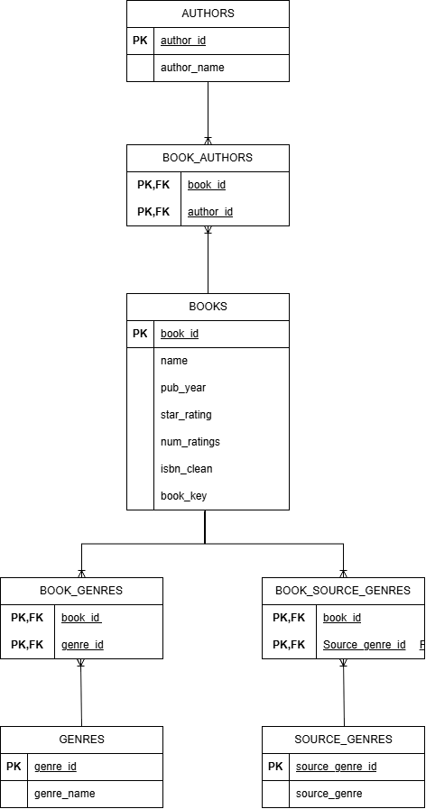
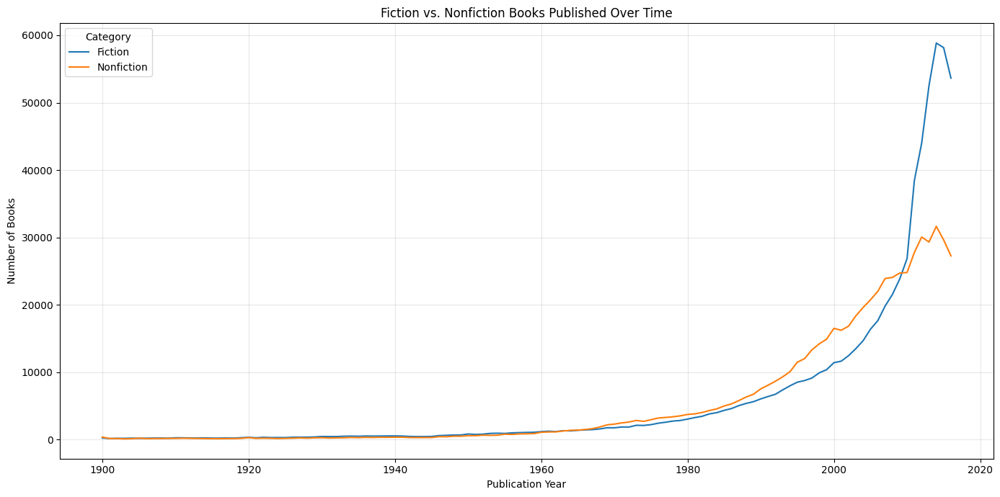
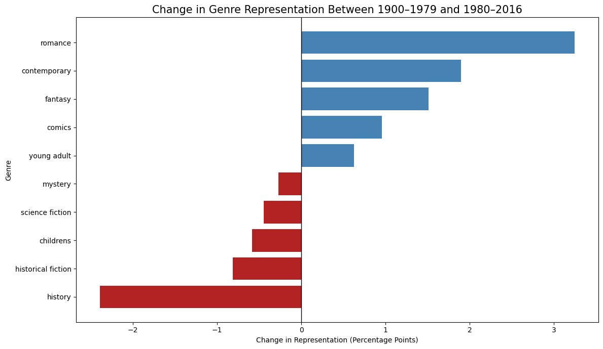
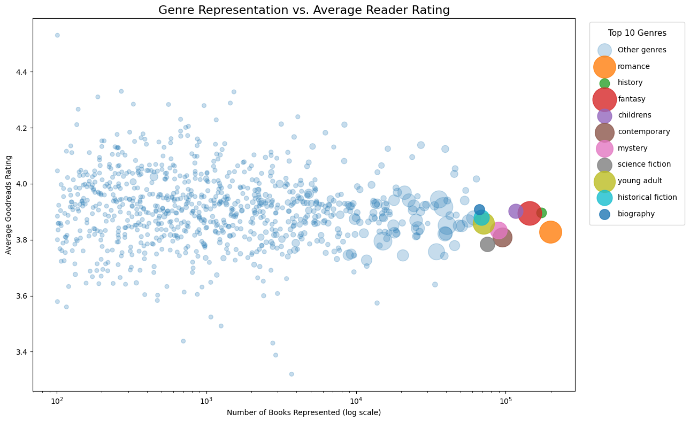

# Goodreads Book Genre Trends Analysis

## Project Overview

This project analyzes trends in book genres using Goodreads book data.

The goal of the project is to examine how the representation of Fiction and Nonfiction books has changed over time, identify the specific genres driving those changes, and investigate whether genre representation is associated with reader ratings and engagement.

The project combines data preparation, relational database design, SQL analysis, and exploratory data visualization.

The final analysis focuses on books published between **1900 and 2016**.

---

## Research Questions

This project explores three primary questions:

1. **How has the representation of Fiction and Nonfiction books changed over time?**

2. **Which specific genres are driving the changes observed in the Fiction and Nonfiction trend?**

3. **How does genre representation relate to average reader ratings and reader engagement?**

These questions form the basis of the three primary visualizations presented in the exploratory data analysis.

---

# Data Sources

The project uses Goodreads book data originally collected from the Goodreads website and distributed through Kaggle.

### Primary Dataset

**Goodreads's Books**

- Author: Justin Nguyen
- Source: Kaggle
- Original source of the book information: Goodreads
- Dataset license: CC0 / Public Domain

Dataset:

https://www.kaggle.com/datasets/khanhdnguyen/goodreadss-books

The dataset contains book-level information including:

- Book ID
- Title
- Authors
- Genres
- Publication information
- Average rating
- Number of ratings
- ISBN information

The dataset documentation notes that the source data may contain duplicates, missing values, invalid values, and multi-valued fields. These characteristics were taken into consideration during the data preparation process.

---

## Data Preparation

The original Goodreads data was provided as multiple Parquet files organized by source genre.

The data preparation process was separated from the exploratory analysis so that the raw data could be cleaned and transformed before being used for analysis.

The preparation process included:

1. Reading the original Parquet files.
2. Selecting the fields required for the project.
3. Combining the individual source files.
4. Converting publication years to numeric values.
5. Cleaning author information.
6. Cleaning and normalizing genre information.
7. Removing records outside the 1900–2016 publication-year range.
8. Creating a unique `book_key` for each book.
9. Identifying books that appeared in multiple source files.
10. Creating normalized relational datasets for books, authors, genres, and their relationships.
11. Assigning primary and foreign keys.
12. Validating the resulting relationships.
13. Saving the prepared datasets as Parquet files.

The final prepared datasets include:

- `books.parquet`
- `authors.parquet`
- `book_authors.parquet`
- `genres.parquet`
- `book_genres.parquet`
- `source_genres.parquet`
- `book_source_genres.parquet`

---

# Relational Database Design

The cleaned data was converted into a relational SQLite database.

The database contains seven tables:

### `books`

Contains one record for each unique book.

Important fields include:

- `book_id`
- `book_key`
- `name`
- `pub_year`
- `star_rating`
- `num_ratings`
- `isbn_clean`

### `authors`

Contains one record for each unique author.

### `book_authors`

A junction table establishing the many-to-many relationship between books and authors.

### `genres`

Contains one record for each unique Goodreads genre.

### `book_genres`

A junction table establishing the many-to-many relationship between books and genres.

### `source_genres`

Contains the original Goodreads source categories represented by the Parquet filenames.

### `book_source_genres`

A junction table identifying which original source categories contained each book.

This relational structure prevents duplicate book records from being stored simply because a book appeared in multiple genre datasets.

---

# Project Structure

The project is organized into separate notebooks based on the major stages of the analysis.

```text
Book_Genre_Trends_Analysis/
│
├── Data/
│   ├── Goodreads_Books/
│   │   └── genres_top100/
│   │
│   ├── prepared/
│   │   ├── books.parquet
│   │   ├── authors.parquet
│   │   ├── book_authors.parquet
│   │   ├── genres.parquet
│   │   ├── book_genres.parquet
│   │   ├── source_genres.parquet
│   │   └── book_source_genres.parquet
│   │
│   └── goodreads_capstone.db
│
├── notebooks/
│   ├── data_preparation.ipynb
│   ├── database_creation.ipynb
│   ├── SQL_analysis.ipynb
│   └── EDA.ipynb
│
├── .gitignore
├── README.md
└── requirements.txt
```
# Entity-Relationship Diagram

The project uses a relational SQLite database to organize books, authors, genres, and their relationships.

The Entity-Relationship Diagram (ERD) below illustrates the database structure, including primary keys, foreign keys, and the relationships between the tables.



### Database Structure

The database consists of seven tables:

- **Books** — Stores information about each unique book.
- **Authors** — Stores each unique author.
- **Genres** — Stores the Goodreads genre classifications associated with books.
- **Source Genres** — Stores the original genre categories represented by the source Parquet files.
- **Book Authors** — Junction table establishing the many-to-many relationship between books and authors.
- **Book Genres** — Junction table establishing the many-to-many relationship between books and genres.
- **Book Source Genres** — Junction table identifying which original source genre dataset(s) contained each book.

The relational structure allows a book to have multiple authors and multiple genres while preventing duplicate books from being treated as separate records.

---

# Requirements


The project requires Python 3 and the following Python libraries:

- pandas
- numpy
- matplotlib
- pyarrow
- sqlite3

`sqlite3` is included with standard Python installations and does not normally need to be installed separately.

---

# Setting Up the Project

## 1. Clone the Repository

Clone the repository from GitHub:

```bash
git clone https://github.com/Hooperbassman/Book_Genre_Trends_Analysis.git
```

Move into the project directory:

```bash
cd Book_Genre_Trends_Analysis
```

---

# Virtual Environment Setup

A virtual environment keeps the project's Python packages isolated from other Python projects.

Python's built-in `venv` module is used to create the environment.

## Windows

Open Command Prompt, PowerShell, or Git Bash from the project directory.

Create the virtual environment:

```bash
python -m venv .venv
```

### Activate on Windows Command Prompt

```cmd
.venv\Scripts\activate
```

### Activate on Windows PowerShell

```powershell
.venv\Scripts\Activate.ps1
```

If PowerShell prevents the activation script from running, the execution policy may need to be adjusted for the current user:

```powershell
Set-ExecutionPolicy -ExecutionPolicy RemoteSigned -Scope CurrentUser
```

### Activate using Git Bash

```bash
source .venv/Scripts/activate
```

---

## macOS and Linux

Create the virtual environment:

```bash
python3 -m venv .venv
```

Activate it:

```bash
source .venv/bin/activate
```

---

# Installing Dependencies

After activating the virtual environment, install the required packages:

```bash
pip install pandas numpy matplotlib pyarrow
```

If a `requirements.txt` file is included with the project, dependencies can instead be installed with:

```bash
pip install -r requirements.txt
```

---

# Verifying the Virtual Environment

After activation, the terminal should display the virtual environment name, usually:

```text
(.venv)
```

You can also verify which Python executable is being used.

### Windows

```bash
where python
```

### macOS/Linux

```bash
which python
```

The returned path should point to the project's `.venv` directory.

---

# Running the Project

The notebooks should be run in the following order:

### 1. `data_preparation.ipynb`

This notebook:

- Reads the original Parquet datasets.
- Combines the source files.
- Cleans publication years.
- Cleans authors.
- Creates unique book keys.
- Processes genres.
- Creates relational DataFrames.
- Assigns database IDs.
- Converts relationships to foreign keys.
- Validates the prepared data.
- Saves the prepared datasets as Parquet files.

### 2. `database_creation.ipynb`

This notebook:

- Loads the prepared Parquet datasets.
- Creates the SQLite database.
- Creates the relational tables.
- Defines primary keys and foreign keys.
- Inserts the prepared data.
- Validates the database structure and relationships.

### 3. `SQL_analysis.ipynb`

This notebook demonstrates intermediate and advanced SQL techniques including:

- Multiple-table joins
- Grouping and aggregation
- `HAVING`
- Subqueries
- Filtering and ordering
- Relational analysis across multiple tables

The SQL analysis satisfies the project requirement to include at least three intermediate/advanced SQL queries.

### 4. `EDA.ipynb`

This notebook uses SQL queries and Python visualization tools to answer the project's primary research questions.

---

# Deactivating the Virtual Environment

When finished working on the project, deactivate the virtual environment with:

```bash
deactivate
```

This command works on Windows, macOS, and Linux.

The virtual environment can be activated again later using the appropriate command described above.

---

# Exploratory Data Analysis

The exploratory analysis tells a three-part story.

## Chart 1 — Fiction vs. Nonfiction Over Time

The first visualization establishes the overall trend by comparing the representation of Fiction and Nonfiction books across publication years from 1900 through 2016.

To create this comparison, original Goodreads source categories were grouped into broader Fiction and Nonfiction classifications.

The purpose of this chart is to answer:

> **How has the representation of Fiction and Nonfiction changed over time?**

### Classification

The project created two analytical groups from the original source categories.

Fiction includes categories such as:

- Fantasy
- Science Fiction
- Romance
- Mystery
- Thriller
- Horror
- Historical Fiction
- Young Adult
- Adventure
- Action
- Paranormal
- Urban Fantasy
- Westerns
- War
- Military Fiction

Nonfiction includes categories such as:

- History
- Biography
- Biography & Memoir
- Science
- Business
- Economics
- Education
- Philosophy
- Psychology
- Politics
- Sociology
- Self Help
- Health
- Religion
- Theology
- Travel
- Nature
- Art
- Music
- Cookbooks
- Cooking

These classifications were created specifically for this analysis and do not alter the original source genre classifications stored in the database.

### Finding



The chart shows that:

The Fiction and Nonfiction trends show a notable shift in the composition of the dataset over time. Nonfiction leads Fiction beginning around 1965 and remains ahead for several decades. Around 2010, however, Fiction experiences a dramatic increase and quickly surpasses Nonfiction by a substantial margin. This sharp reversal suggests that the overall change in the dataset is not simply a gradual shift between Fiction and Nonfiction, but may be driven by significant growth in specific Fiction genres during the later period.

This establishes the broad trend that the remaining analysis attempts to explain.

---

# Chart 2 — Which Genres Are Driving the Change?

The second visualization moves from broad Fiction/Nonfiction categories to individual genres.

The purpose is to answer:

> **Which specific genres are driving the changes observed in the Fiction and Nonfiction trend?**

The analysis divides publication years into two periods:

- **1900–1979**
- **1980–2016**

The 10 most represented genres were identified and their changes in representation between the two periods were calculated.

A positive value indicates that a genre became more represented in the later period.

A negative value indicates that a genre became less represented in the later period.

### Finding



The results indicate that:

The genre-level analysis helps explain the shift observed in Chart 1. Romance, Contemporary, and Fantasy showed the largest increases in representation between 1900–1979 and 1980–2016, while History and Historical Fiction experienced notable decreases. The growth of Romance and Fantasy—both primarily Fiction genres—corresponds with the sharp rise in Fiction observed in Chart 1. In contrast, the decline in History, a primarily Nonfiction category, is consistent with the weakening relative representation of Nonfiction during the later period.

This step moves the analysis from simply observing that the overall composition of books changed to identifying the specific genres responsible for those changes.

---

# Chart 3 — Genre Representation vs. Reader Ratings

The third visualization examines whether the most represented genres also tend to have higher or lower average Goodreads ratings.

The analysis answers:

> **Does the number of books represented within a genre appear to be related to reader ratings and engagement?**

For each genre, the analysis calculates:

- Number of unique books
- Average Goodreads rating
- Total number of Goodreads ratings

Genres with fewer than 100 books are excluded to reduce the influence of very small samples.

The following categories are also excluded:

- Audiobook
- Ebooks
- Comics
- Picture Books
- Short Stories
- Graphic Novels

These categories were excluded because they describe formats, media types, or literary forms rather than being directly comparable to traditional genres.

They remain in the underlying database and are excluded only from this particular analysis.

### Finding



The results indicate:

The relationship between genre representation and average reader ratings appears to be relatively weak. The highly represented genres generally cluster around an average Goodreads rating of approximately 3.8 stars, with the top 10 most represented genres showing very similar ratings. Overall, there is little noticeable difference in average rating between highly represented genres and the remaining genres in the dataset. This suggests that greater genre representation does not necessarily correspond to higher or lower reader ratings.

Point size represents the total number of Goodreads ratings, providing an additional indication of reader engagement.

---

# Overall Data Story

The three visualizations work together to tell a progression-based story.

### 1. Broad Trend

The first chart establishes that the representation of Fiction and Nonfiction has changed across the period from 1900 to 2016.

### 2. Drivers of Change

The second chart investigates that change at the genre level, identifying which specific genres became more or less represented between the earlier and later periods.

### 3. Reader Reception

The third chart then examines whether the genres that are most heavily represented also differ in average reader ratings and reader engagement.

Together, the analysis moves from:

**What changed?**

↓

**Which genres caused the change?**

↓

**How are those genres received by readers?**

This provides a more complete picture of how Goodreads book categories have evolved over time rather than relying on a single measure of genre popularity.

---

# Key Findings and Conclusions

Based on the three visualizations, the project evaluates several broader observations.

### Finding 1 — Fiction and Nonfiction Representation

**[INSERT FINAL CHART 1 CONCLUSION]**

The Fiction/Nonfiction comparison demonstrates that:

**[INSERT CONCLUSION]**

### Finding 2 — Genre-Level Changes

**[INSERT FINAL CHART 2 CONCLUSION]**

The genre-level comparison shows that:

**[INSERT CONCLUSION]**

### Finding 3 — Ratings and Genre Representation

**[INSERT FINAL CHART 3 CONCLUSION]**

The relationship between genre representation and reader ratings suggests:

**[INSERT CONCLUSION]**

### Overall Conclusion

The analysis demonstrates that changes in the Goodreads book landscape cannot be explained solely by looking at broad Fiction versus Nonfiction categories.

Examining individual genres reveals which categories are responsible for changes in representation, while the rating analysis provides additional context about how readers respond to those genres.

The relational database structure made it possible to analyze these relationships without treating duplicate appearances of the same book as separate books.

---

# Limitations

Several limitations should be considered when interpreting the results.

### Goodreads Source Categories

The original Goodreads genre classifications are user-generated and may not represent mutually exclusive or standardized literary categories.

A single book can belong to multiple genres.

### Fiction and Nonfiction Classification

The Fiction and Nonfiction groupings used in Chart 1 were created for this project based on the original source categories.

Some categories may contain books that could reasonably be classified differently.

### Publication Years

The analysis is limited to books with publication years between 1900 and 2016.

Books outside this range are not included in the final analysis.

### Dataset Representation

The dataset represents books collected from Goodreads source categories and should not be interpreted as a complete census of all books published during the period.

Therefore, changes in the dataset's composition should not automatically be interpreted as changes in the publishing industry as a whole.

### Ratings

Average Goodreads ratings represent user ratings recorded by Goodreads and may be affected by differences in the number of ratings received by individual books.

For the genre-rating analysis, a minimum threshold of 100 books per genre was used to reduce the effect of very small samples.

---

# Technologies and Tools

This project was developed using:

- **Python**
- **Pandas**
- **NumPy**
- **Matplotlib**
- **PyArrow**
- **SQLite3**
- **Jupyter Notebook**
- **Git**
- **GitHub**

### Python

Python was used for data preparation, transformation, database construction, SQL analysis, and visualization.

### Pandas

Pandas was used for:

- Data cleaning
- Data transformation
- DataFrame manipulation
- Reading and writing Parquet files
- Preparing relational datasets

### NumPy

NumPy was used for numerical operations and handling array-based data during the data preparation process.

### PyArrow

PyArrow was used to read and write the large Parquet datasets efficiently.

### SQLite

SQLite was used to create the relational database and perform SQL-based analysis.

### Matplotlib

Matplotlib was used to create the project's visualizations.

### Git and GitHub

Git was used for version control and GitHub was used to store and document the project source code.

---

# AI and External Assistance

AI assistance was used during the development of this project.

**ChatGPT by OpenAI** was used as a development and editing assistant for:


- Relational database design inspiration
- Entity-Relationship Diagram planning
- Troubleshooting Python and SQLite errors
- Notebook organization
- Markdown documentation
- README development
- Visualization planning
- Editing and improving explanatory text

The final analytical decisions, data validation, interpretation of results, and project implementation were reviewed and tested by the project author.

AI-generated code was executed and validated within the project environment before being incorporated into the analysis.

---

# Academic Project Requirements

This project was designed to satisfy the following capstone requirements:

- Design a relational database and explain the reasoning behind the design.
- Create and include an Entity-Relationship Diagram (ERD).
- Build the database using SQLite3 and Python.
- Include at least three intermediate/advanced SQL queries using techniques such as joins, grouping, aggregation, `HAVING`, and subqueries.
- Include at least three different chart types.
- Create well-designed, labeled visualizations that communicate a clear analytical story.
- Document data sources and provide appropriate credit.
- Document tools, frameworks, libraries, and external assistance used.

---

# Author

**Andrew Hooper**

Goodreads Book Genre Trends Analysis

2026